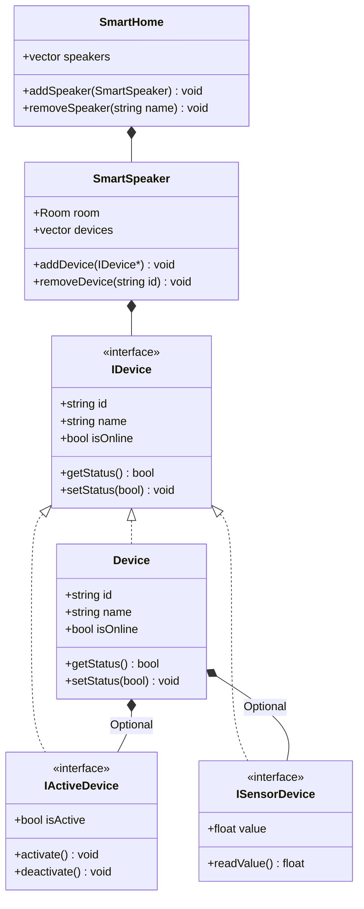

### Описание проекта "Умный дом"

Проект разделен на две основные части: **Model** (модели данных) и **Controller** (логика управления).  

#### **1. Model**  

Реализация абстрактного классы (интерфейсы) и композицию:

- **`IDevice `** – базовый интерфейс для всех устройств (ID, имя, статус онлайн/оффлайн).  
- **`IActiveDevice`** – интерфейс для устройств с управлением (вкл/выкл). (например, лампочка, пылесос).  
- **`ISensorDevice`** – интерфейс для устройств с датчиками (например, термометр).  

Содержит классы, описывающие структуру умного дома:  

- **`Device`** – базовая реализация IDevice  
- **`Room`** – описывает комнату (имя, номер, тип: кухня, коридор и т.д.).  
- **`SmartSpeaker`** – умная колонка, содержит информацию о комнате (`Room`) и список подключенных устройств (`Device`).  
- **`SmartHome`** – управляет колонками (`SmartSpeaker`), поддерживает сортировку по имени и поиск.  

#### **2. Controller**  
Разделяем логику на два контроллера:  

1. **`DeviceController`** – управляет устройствами:  
   - Включение/выключение (`ActiveDevice`).  
   - Получение данных с датчиков (`SensorDevice`).  
   - Проверка состояния устройств.  

2. **`SmartHomeController`** – управляет умным домом:  
   - Добавление/удаление колонок (`SmartSpeaker`).  
   - Поиск колонок по имени.  
   - Управление устройствами через колонки.  

---

### **Диаграммы**  

#### **1. Model (UML-диаграмма классов)**  



#### **2. Controller (UML-диаграмма классов)**  


---

Идея но возможно не будет реализованно 
Собрать приложения в виде webAssemble а ui будет на js vue как будто это один из самых простых способов 

## Для сборки 

emcc main.cpp -o index.js -sEXPORTED_FUNCTIONS=_add 

## Установка среды для сборки **Emscripten**  
### **Linux/macOS**  
```bash
git clone https://github.com/emscripten-core/emsdk.git
cd emsdk
./emsdk install latest
./emsdk activate latest
source ./emsdk_env.sh  # Добавляет emcc в PATH
```

```bash
emcc --version  # Должен вывести версию Emscripten
```


